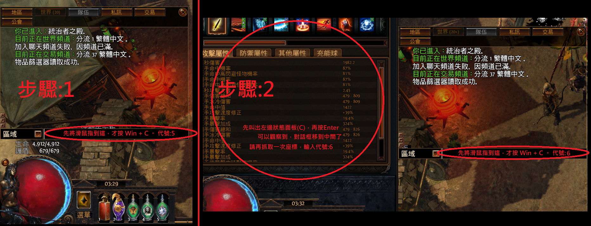
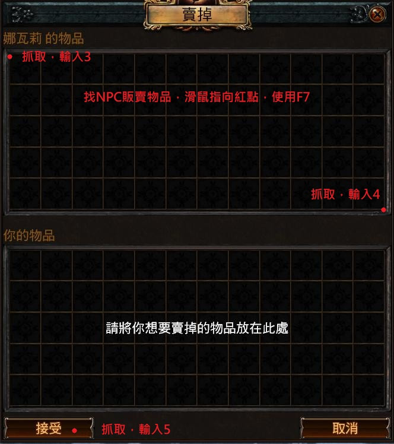
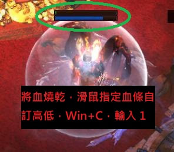

# 執行計劃書:sidpayfor.html 結構修復 + sidexiletoolbox.html 補圖

> 專案路徑:`C:\Code play first\Sid Automation Lab`
> 撰寫者角色:PM / 技術專家(規劃與風險把關)
> 執行者:另一個 Agent(依本文件逐步執行,**不要自行做計劃外的判斷**)
> 前置需求:所有指令一律用 `pwsh` 執行(不要用舊版 `powershell.exe`,原因見 `AGENT.md` 的 Shell 建議段落)

---

## 0. 背景與現況(執行前必讀)

這是兩個獨立小任務,可以分開驗收,但建議照本文件順序做:

### 任務一:`sidpayfor.html`(贊助頁)結構修復
先前診斷發現此檔案內嵌了一份完整獨立的 HTML 文件(`<!DOCTYPE html><html><head>...</head><body>...</body></html>`),被貼進 Weebly 的自訂 HTML 小工具區塊裡,導致**同一個檔案裡出現兩組 `<html>`／`<head>`／`<body>`／`</html>` 標籤**,屬於不合法的巢狀 HTML 結構。瀏覽器目前會忽略中間多出來的標籤、把後面殘留的舊版 Weebly 內容也一起渲染出來,造成頁面下方多出一截無用/重複的舊內容。

**⚠️ 狀態注意**:本文件的「步驟 1」(移除巢狀 DOCTYPE/html/head 開頭)**已經執行完成**,不用再做。執行 Agent 應該從「步驟 2」開始,但**動手前務必先重新讀取檔案目前內容確認**,不要假設步驟 1 一定成功——用 `read_file` 或搜尋確認 `<div class="wcustomhtml"><script src="gdpr/gdprscript.js` 這段是否已經存在(存在代表步驟 1 已完成)。

### 任務二:`sidexiletoolbox.html` 補回 3 張遺失的示範圖
已確認 3 個檔案都存在於 `uploads/7/7/0/3/77032051/`,只是 HTML 裡的 `` 標籤被拿掉、沒接上,純粹是「接線」工作。

### 使用者已確認的 2 個決定(執行 Agent 不需要再詢問,照做即可):
1. **WeChat QR 碼**:是「加好友聯繫用」的第二聯繫管道(給不方便用 FB 的中國大陸使用者),**不是**贊助碼。要把它從舊版孤兒殘留搬進「02 / 聯繫作者領取授權」現代化卡片區,跟 FB 並列。
2. **「真的有在運作的網站啊，不是騙人~」段落**:原圖是 GIF,使用者已決定整段刪除(含文字與圖片容器)。

---

## 1. 任務一:`sidpayfor.html` 剩餘步驟

### 步驟 2 — 移除多餘的 `</head><body>`

用 `edit_block` 執行:

- **file_path**: `C:\Code play first\Sid Automation Lab\sidpayfor.html`
- **old_string**:
```
</style>
</head>
<body>
<div class="wrap">
```
- **new_string**:
```
</style>
<div class="wrap">
```

### 步驟 3 — 把 WeChat QR 加進「02 / 聯繫作者領取授權」卡片區

- **file_path**: 同上
- **old_string**:
```
      <div class="fb-note">
        請私訊提供：<span class="hl">1. 付款名稱</span> 與 <span class="hl">2. 腳本內的硬體序號 (HWID)</span><br>
        作者將在確認後回傳授權檔案。
      </div>
    </div>
  </div>

  <div class="section">
    <div class="section-title">03 / 交易安全與授權規範</div>
```
- **new_string**:
```
      <div class="fb-note">
        請私訊提供：<span class="hl">1. 付款名稱</span> 與 <span class="hl">2. 腳本內的硬體序號 (HWID)</span><br>
        作者將在確認後回傳授權檔案。
      </div>
    </div>
    <div class="fb-box" style="margin-top:20px;">
      <p>大陸地區用戶若不便使用 FB，可掃描下方 QR Code 加 WeChat 聯繫</p>
      
      <div class="fb-note">
        提供方式同上：<span class="hl">付款名稱</span> 與 <span class="hl">硬體序號 (HWID)</span>
      </div>
    </div>
  </div>

  <div class="section">
    <div class="section-title">03 / 交易安全與授權規範</div>
```

> ⚠️ 注意:`old_string` 必須完全匹配唯一一處,執行前用 `read_file` 確認這段文字目前的縮排/換行跟上面一致,如果 `edit_block` 回報找不到匹配或匹配多於一處,停下來回報,不要用更寬鬆的匹配硬套。

### 步驟 4 — 移除多餘的 `</body></html>`(內嵌文件的結尾)

- **file_path**: 同上
- **old_string**:
```
<script src="https://cdn.jsdelivr.net/npm/fuse.js@7.0.0/dist/fuse.min.js" defer></script>
<script src="files/search.js" defer></script>
</body>
</html></div>
```
- **new_string**:
```
<script src="https://cdn.jsdelivr.net/npm/fuse.js@7.0.0/dist/fuse.min.js" defer></script>
<script src="files/search.js" defer></script>
</div>
```

### 步驟 5 — 移除舊版孤兒殘留的 WeChat QR 區塊(功能已搬到步驟 3 的新卡片,這裡是重複內容,要刪掉)

- **file_path**: 同上
- **old_string**:
```
<div><div class="wsite-image wsite-image-border-none" style="padding-top:10px;padding-bottom:10px;margin-left:0px;margin-right:0px;text-align:center">
<a href='uploads/7/7/0/3/77032051/wechat-qrcord_orig.jpg' rel='lightbox' onclick='if (!lightboxLoaded) return false'>
</a>
<div style="display:block;font-size:90%"></div>
</div></div>

<div id="352129758961469908"><div></div></div>

<div><div id="771899791402817794"
```
- **new_string**:
```
<div><div id="771899791402817794"
```

### 步驟 6 — 刪除「真的有在運作的網站啊」整段(含容器,GIF 已由使用者決定捨棄)

- **file_path**: 同上
- **old_string**:
```
	<div class="wsite-section-wrap">
	<div class="wsite-section wsite-body-section wsite-section-bg-image wsite-background-29" style="background-image: url(&quot;/uploads/7/7/0/3/77032051/background-images/1292486750.jpg&quot;) ;background-repeat: no-repeat ;background-position: 50% 50% ;background-size: 100% ;background-color: transparent ;background-size: cover;" >
		<div class="wsite-section-content">
    		<div class="container">
			<div class="wsite-section-elements">
				<div class="paragraph" style="text-align:center;"><strong><font color="#a9e976">&#30495;&#30340;&#26377;&#22312;&#36939;&#20316;&#30340;&#32178;&#31449;&#21734;&#65292;&#19981;&#26159;&#35408;&#39449;~</font></strong></div>

<div><div class="wsite-image wsite-image-border-none " style="padding-top:10px;padding-bottom:10px;margin-left:0px;margin-right:10px;text-align:center">
<a>

</a>
<div style="display:block;font-size:90%"></div>
</div></div>
			</div>
		</div>
      </div>

	</div>
</div>
```
- **new_string**: (空字串,整段刪除)

> ⚠️ **這步是這份計劃裡風險最高的一步**,因為要刪除的區塊有 5 層 `<div>` 開合要正好對齊(`wsite-section-wrap` / `wsite-section` / `wsite-section-content` / `container` / `wsite-section-elements`)。刪除後緊接著的下一行應該是 `</div>`(關閉 `wsite-content`)。**執行完這步之後,務必做「驗證步驟」的 HTML 結構檢查,不要只憑肉眼看起來正常就跳過。**

---

## 2. 任務二:`sidexiletoolbox.html` 補圖

### 步驟 A — 補「對話框的抓取，非常重要」對應的圖(`1847905122_2.png`)

- **file_path**: `C:\Code play first\Sid Automation Lab\sidexiletoolbox.html`
- **old_string**:
```
<span class='imgPusher' style='float:left;height:0px'></span><span style='display: table;width:auto;position:relative;float:left;max-width:100%;;clear:left;margin-top:0px;*margin-top:0px'><a></a><span style="display: table-caption; caption-side: bottom; font-size: 90%; margin-top: -10px; margin-bottom: 10px; text-align: center;" class="wsite-caption"></span></span>
<div class="paragraph" style="display:block;">&#23565;&#35441;&#26694;&#30340;&#25235;&#21462;&#65292;&#38750;&#24120;&#37325;&#35201;&#12290;</div>
```
- **new_string**:
```
<span class='imgPusher' style='float:left;height:0px'></span><span style='display: table;width:auto;position:relative;float:left;max-width:100%;;clear:left;margin-top:0px;*margin-top:0px'><a></a><span style="display: table-caption; caption-side: bottom; font-size: 90%; margin-top: -10px; margin-bottom: 10px; text-align: center;" class="wsite-caption"></span></span>
<div class="paragraph" style="display:block;">&#23565;&#35441;&#26694;&#30340;&#25235;&#21462;&#65292;&#38750;&#24120;&#37325;&#35201;&#12290;</div>
```

### 步驟 B — 補「背包F7設定相關」與其右側相鄰的圖(`1029564595_2.jpg` + `1003025771_2.jpg`)

這兩張圖在同一個 `wsite-multicol` 表格的左右兩欄,相鄰,建議一次改完:

- **file_path**: 同上
- **old_string**:
```
<div class="paragraph" style="display:block;">&#32972;&#21253;F7&#35373;&#23450;&#30456;&#38364;</div>
<hr style="width:100%;clear:both;visibility:hidden;"></hr>

<div><div class="wsite-image wsite-image-border-none " style="padding-top:10px;padding-bottom:10px;margin-left:0;margin-right:0;text-align:center">
<a>
</a>
<div style="display:block;font-size:90%"></div>
</div></div>


					
				</td>				<td class="wsite-multicol-col" style="width:50%; padding:0 15px;">
					
						

<div><div class="wsite-image wsite-image-border-none " style="padding-top:10px;padding-bottom:0px;margin-left:0px;margin-right:0px;text-align:left">
<a>
</a>
<div style="display:block;font-size:90%"></div>
</div></div>
```
- **new_string**:
```
<div class="paragraph" style="display:block;">&#32972;&#21253;F7&#35373;&#23450;&#30456;&#38364;</div>
<hr style="width:100%;clear:both;visibility:hidden;"></hr>

<div><div class="wsite-image wsite-image-border-none " style="padding-top:10px;padding-bottom:10px;margin-left:0;margin-right:0;text-align:center">
<a>

</a>
<div style="display:block;font-size:90%"></div>
</div></div>


					
				</td>				<td class="wsite-multicol-col" style="width:50%; padding:0 15px;">
					
						

<div><div class="wsite-image wsite-image-border-none " style="padding-top:10px;padding-bottom:0px;margin-left:0px;margin-right:0px;text-align:left">
<a>

</a>
<div style="display:block;font-size:90%"></div>
</div></div>
```

---

## 3. 驗證步驟(每完成一個任務都要做,不要全部做完才驗)

### 3.1 語法/結構檢查
```pwsh
cd "C:\Code play first\Sid Automation Lab"
node scripts\check-missing.mjs
```
預期輸出:`missing 0`(不應該因為這次改動新增任何 missing 項目;WeChat 圖跟 sidexiletoolbox 3 張圖接上後,理論上 missing 數量不變,因為這些檔案本來就存在,只是沒被引用)。

### 3.2 HTML 結構完整性檢查(針對任務一步驟 6 的高風險刪除)
用 `pwsh` 跑一個簡單的標籤計數,確認 `sidpayfor.html` 裡 `<div` 與 `</div>` 數量相等(粗略但有效的防呆):
```pwsh
cd "C:\Code play first\Sid Automation Lab"
$content = Get-Content sidpayfor.html -Raw -Encoding utf8
$open = ([regex]::Matches($content, "<div")).Count
$close = ([regex]::Matches($content, "</div>")).Count
Write-Host "open div: $open, close div: $close"
```
如果 open/close 數字不相等,代表步驟 6 的刪除破壞了結構,**必須停下來排查,不要繼續往下做**。

同時確認整份檔案只剩「一組」`<html>` 與「一組」`</html>`:
```pwsh
(Select-String -Path sidpayfor.html -Pattern "<html" -AllMatches).Matches.Count
(Select-String -Path sidpayfor.html -Pattern "</html>" -AllMatches).Matches.Count
```
兩者都應該輸出 `1`。

### 3.3 本機視覺驗證
```pwsh
cd "C:\Code play first\Sid Automation Lab"
python -m http.server 8000
```
瀏覽器打開:
- `http://localhost:8000/sidpayfor.html`
  - 確認瀏覽器分頁標題顯示的是原本頁面的 `<title>`(贊助腳本 - Sid Automation Lab),不是被內嵌文件的 `SID LICENSE CENTER` 蓋掉
  - 確認「02 / 聯繫作者領取授權」區塊下方新增了 WeChat QR 卡片,QR 圖清楚可見
  - 確認頁面往下捲動,**不會再看到**舊版孤兒 WeChat 區塊、也**不會再看到**「真的有在運作的網站啊」那段文字或空圖框
  - 確認頁面沒有明顯版面跑掉、跳版
- `http://localhost:8000/sidexiletoolbox.html`
  - 確認「對話框的抓取，非常重要」上方出現圖片
  - 確認「背包F7設定相關」旁邊出現圖片
  - 確認右側原本就有的 `1202643573_2.jpg` 上方也出現了新補上的圖片,兩張圖沒有互換或錯位

### 3.4 Git diff 檢查
提交前務必看一次完整 diff,確認**沒有動到計劃外的內容**:
```pwsh
git diff sidpayfor.html sidexiletoolbox.html
```

---

## 4. 風險與 Troubleshooting

| 風險 | 徵兆 | 處置 |
|------|------|------|
| `edit_block` 的 `old_string` 找不到匹配 | 工具回報 no match / 0 replacements | 代表檔案目前內容跟本文件假設的不一致(可能步驟 1 沒真的做完,或檔案被其他人動過)。**停下來重新讀取檔案該區域的實際內容,跟本文件比對差異在哪,不要用近似字串硬套** |
| `edit_block` 回報 old_string 匹配到超過 1 處 | 工具報錯 expected 1 但找到多個 | 說明給的 `old_string` context 不夠獨特。擴大 old_string 涵蓋範圍(往前後多抓幾行)再試一次,不要縮小範圍 |
| 步驟 6 刪除後 div 開合數對不上 | 3.2 的檢查腳本輸出 open ≠ close | 用 `git diff` 找出這次改動的具體差異,人工核對是不是刪太多或刪太少一層 `</div>`,必要時用 `git checkout -- sidpayfor.html` 整個還原重來,不要在錯誤基礎上疊加修補 |
| 瀏覽器分頁標題還是顯示 `SID LICENSE CENTER` | 步驟 2/4 沒有確實移除內嵌的 `<head>`/`<title>` | 回頭確認步驟 1(移除 DOCTYPE/html/head 開頭那段)真的有把 `<title>SID LICENSE CENTER</title>` 一起拿掉 |
| WeChat QR 圖片在頁面上顯示但尺寸爆版或跑版 | 視覺檢查發現 QR 圖過大/過小/裁切 | 調整步驟 3 裡 `` 的 `style="width:180px;..."`,不要動到 `.fb-box` 的共用 CSS class,避免影響 FB 卡片樣式 |
| `check-missing.mjs` 跑出非預期的 missing 項目 | 3.1 輸出 missing > 0 且不是原本已知的 siddownload 相關(如果 siddownload 任務還沒做的話當下 baseline 是 missing 2) | 對照本次改動的 3 個檔案路徑(`wechat-qrcord_orig.jpg`、`1847905122_2.png`、`1029564595_2.jpg`、`1003025771_2.jpg`),確認路徑拼字、大小寫是否跟實際檔案完全一致 |

---

## 5. 完成後的收尾動作

1. 更新 `AGENT.md` 版本紀錄,新增一條說明本次修復(結構修復 + 補圖 + WeChat 聯繫管道)
2. 更新 `README.md` 的已知問題列表(如果有記錄 `sidpayfor.html` QR 空殼、`sidexiletoolbox.html` 缺圖 這兩項,這次修完了要拿掉)
3. `git add sidpayfor.html sidexiletoolbox.html AGENT.md README.md`
4. `git commit -m "fix: sidpayfor.html 移除巢狀 HTML 結構、補 WeChat 聯繫方式；sidexiletoolbox.html 補回 3 張示範圖"`
5. `git push`(觸發 Vercel 自動部署)
6. 部署後用 Vercel 的 production URL 重複一次 3.3 的視覺驗證,確認正式環境跟本機一致

---

## 6. 明確的「不要做」清單(避免執行 Agent 自由發揮)

- 不要順手把 `.fb-box` 的共用 CSS 改掉(會影響 FB 卡片跟 WeChat 卡片兩者的外觀一致性)
- 不要把 `siddownload.html` 移除任務(另一份計劃)混進這次 commit,兩者分開提交
- 不要因為看到 `<div id="352129758961469908"><div></div></div>` 這種空殼 id 就順手清理其他無關的空殼 div——本次範圍只限本文件列出的 6+2 個步驟
- 不要引入新的 npm 套件或建置流程來做這件事,純字串替換即可完成
